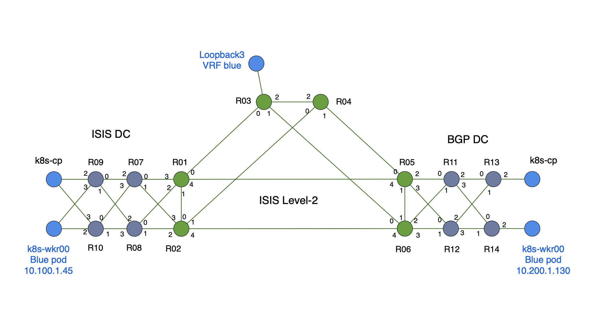

# cilium-srv6

## Cloud-Native SRv6 with Cilium

Note: This lab makes use of Cilium Enterprise, which is a licensed set of features. Therefore, this lab is available to Cisco internal audience only. If you are an operator interested in SRv6 on Cilium or other Enterprise features, please contact the relevant Isovalent sales team.

The original POC was developed in partnership with Arkadiusz Kaliwoda, Cisco SE in EMEA SP. Kali has also published demo/POC materials here: 

https://wwwin-github.cisco.com/emear-telcocloud/iblog

Many thanks Kali for your help and insight in this project!

### Contents
* Cloud-Native SRv6 with Cilium [LINK](#cloud-native-srv6-with-cilium)
* Introduction [LINK](#introduction)
* Containerlab [LINK](#containerlab)
* Ansible deploy XRd topology and K8s VMs [LINK](#ansible-deploy-xrd-topology-and-k8s-vms)
* Accessing XRd routers [LINK](#accessing-xrd-routers)
* Initialize the Cluster [LINK](#initialize-the-kubernetes-cluster)
* Install and Configure Cilium Enterprise CNI [LINK](#install-and-configure-cilium-enterprise-cni)
* Setup Cilium BGP Peering [LINK](#setup-cilium-bgp-peering)
* Cilium SRv6 Sidmanager and Locators [LINK](#cilium-srv6-sidmanager-and-locators)
* Establish Cilium VRFs [LINK](#establish-cilium-vrfs)
* Setup Cilium SRv6 Responder [LINK](#setup-cilium-srv6-responder)
* Appendix 1: Other Useful Commands [LINK](#appendix-1-other-useful-commands)
* Appendix 2: Notes, Other [LINK](#appendix-2-notes-other)

## Introduction
This lab has been published to the Cisco dCloud catalog and is accessible to all Cisco employees, partners, and customers for hands on exposure to Cilium's SRv6 implementation. Isovalent has also published a number of labs covering a wide range of Cilium, Hubble, and Tetragon features here:

https://cilium.io/labs/

The Cilium-SRv6 dCloud Lab instance consists of a single large Ubuntu virtual machine which hosts an XRd virtual network topology and a set of nested Ubuntu VMs where we'll initialize Kubernetes and install and configure Cilium. We will use an ansible script to launch the XRd virtual network and the two K8s VMs, that way we can get to the Cilium SRv6 work as quickly as possible.

1. Once the dCloud session is running establish an Anyconnect VPN session to:
``` 
dcloud-rtp-anyconnect.cisco.com
```

  Use the username and password supplied in the dCloud UI

2. Once connected to VPN the *`topology-host`* VM is reachable via ssh as shown on the diagram above.
```
ssh cisco@198.18.133.100
```

  User/PW for all VMs and XRd instances is: *`cisco/cisco123`*

3. Once you've ssh'd into the *`topology-host`* VM cd into the cilium-srv6 directory and list the files and sub-directory structure. The majority of tasks for this lab will be run from within this directory

  ```
  cd cilium-srv6
  ls
  tree -L 3
  ```

## Containerlab
The Cilium SRv6 dCloud lab relies on the open source Containerlab tool to define and deploy our virtual network topology.
From the https://containerlab.dev/ site:

*With the growing number of containerized Network Operating Systems grows the demand to easily run them in the user-defined, versatile lab topologies.*

*Unfortunately, container orchestration tools like docker-compose are not a good fit for that purpose, as they do not allow a user to easily create connections between the containers which define a topology.*

*Containerlab provides a CLI for orchestrating and managing container-based networking labs. It starts the containers, builds a virtual wiring between them to create lab topologies of users choice and manages labs lifecycle.*

Containerlab has been pre-installed on the *`topology-host`* VM and we will use it to spin up our XRd virtual network. 

For reference the Containerlab topology definition file can be found here:  [topology](./topology.yml). 

Or you may review it from the topology-host command line: 

```
cat topology.yml
```

The first version of the Cilium SRv6 lab has quite a few XRd routers in the topology:

*`Figure 1: Diagram of the XRd virtual network and k8s vms that we'll activate via ansible script`*



The reason we have so many routers is it gives us the ability to expand the number and types of use cases in future iterations. For the lab you're currently engaged it we'll primarily focus on the "ISIS DC" and K8s host VMs in the lower left hand portion of the network:


The *`k8s-cluster00-cp`* and *`k8s-cluster00-wkr00`* VMs have Kubernetes packages loaded and will represent our K8s cluster. In this lab we'll initialize the k8s cluster, install Cilium, and then establish SRv6 L3VPN instances between our K8s nodes and the XRd network.

* Note: if you wish to reconstuct this lab in your own environment you may use these [Instructions](./k8s-install.md) to install containerd and kubeadm/kubelet/kubectl on one or more hosts or VMs (bare metal, dCloud, public cloud, etc.)

## Ansible deploy XRd topology and K8s VMs
Our first step will be to run an Ansible playbook that will deploy the XRd virtual network and our Kubernetes VMs. 

1. From the *`topology-host`* cd into the cilium-srv6/ansible/ directory
```
cd ~/cilium-srv6/ansible/
```

2. Run the deploy-playbook.yml ansible script
```
ansible-playbook -i hosts deploy-playbook.yml -e "ansible_user=cisco ansible_ssh_pass=cisco123 ansible_sudo_pass=cisco123" -vv
```

  The script should complete after a couple minutes and will output status messages along the way. Once complete we expect to see output that looks something like this:

  ```
  PLAY RECAP ********************************************************************************************************************************************************
  localhost                  : ok=14   changed=12   unreachable=0    failed=0    skipped=0    rescued=0    ignored=0   
  ```

3. Next verify the deployment of XRd containers, K8s VMs, and linux bridge instances:

4. List docker/XRd containers with the *`docker ps`* command. For output we expect to see a table of running XRd containers  
```
docker ps
```

  Output should be something like:

  ```
  cisco@clab-host:~$ docker ps
  CONTAINER ID   IMAGE                             COMMAND                  CREATED        STATUS       PORTS                                                   NAMES
  25f8e10af52b   ios-xr/xrd-control-plane:24.4.1   "/usr/sbin/init"         6 weeks ago    Up 6 weeks                                                           clab-cilium-srv6-xrd03
  655e16455af6   ios-xr/xrd-control-plane:24.4.1   "/usr/sbin/init"         6 weeks ago    Up 6 weeks                                                           clab-cilium-srv6-xrd05
  688d9f045828   ios-xr/xrd-control-plane:24.4.1   "/usr/sbin/init"         6 weeks ago    Up 6 weeks                                                           clab-cilium-srv6-xrd10
  08803b9819c3   ios-xr/xrd-control-plane:24.4.1   "/usr/sbin/init"         6 weeks ago    Up 6 weeks                                                           clab-cilium-srv6-xrd02
  8b154fd35176   ios-xr/xrd-control-plane:24.4.1   "/usr/sbin/init"         6 weeks ago    Up 6 weeks                                                           clab-cilium-srv6-xrd06
  f07e83b46c42   ios-xr/xrd-control-plane:24.4.1   "/usr/sbin/init"         6 weeks ago    Up 6 weeks                                                           clab-cilium-srv6-xrd04
  7d1ccf298482   ios-xr/xrd-control-plane:24.4.1   "/usr/sbin/init"         6 weeks ago    Up 6 weeks                                                           clab-cilium-srv6-xrd07
  273dfbe2aa50   ios-xr/xrd-control-plane:24.4.1   "/usr/sbin/init"         6 weeks ago    Up 6 weeks                                                           clab-cilium-srv6-xrd08
  3a69c95746f0   ios-xr/xrd-control-plane:24.4.1   "/usr/sbin/init"         6 weeks ago    Up 6 weeks                                                           clab-cilium-srv6-xrd01
  b325efcdd96b   ios-xr/xrd-control-plane:24.4.1   "/usr/sbin/init"         6 weeks ago    Up 6 weeks                                                           clab-cilium-srv6-xrd12
  a4515ef99a01   ios-xr/xrd-control-plane:24.4.1   "/usr/sbin/init"         6 weeks ago    Up 6 weeks                                                           clab-cilium-srv6-xrd11
  d13a7eabc0e8   ios-xr/xrd-control-plane:24.4.1   "/usr/sbin/init"         6 weeks ago    Up 6 weeks                                                           clab-cilium-srv6-xrd09
  5012a37725a1   ios-xr/xrd-control-plane:24.4.1   "/usr/sbin/init"         6 weeks ago    Up 6 weeks                                                           clab-cilium-srv6-xrd14
  9b26fb45e4e3   ios-xr/xrd-control-plane:24.4.1   "/usr/sbin/init"         6 weeks ago    Up 6 weeks                                                           clab-cilium-srv6-xrd13
  ```

5. List the KVM virtual machines that will make up our K8s cluster: 
```
virsh list --all
```

  Output should show a pair of running VMs: *`k8s-cluster00-cp`* and *`k8s-cluster00-wkr00`*

6. List linux bridge instances on the topology-host VM:
```
brctl show
```

  With the *`brctl show`* command we expect to see a table of linux bridge instances, something like:

  ```
  bridge name	bridge id		STP enabled	interfaces
  br-5349196ff1f6		8000.02426ed62905	no		veth0da4256
                veth167cd28
                veth40ec7f2
                veth4e7d77e
                veth4fbd4c8
                veth901fb9e
                vetha834dac
                vethaea71ca
                vethb80748b
                vethb8e139a
                vethb95375d
                vethbdd473a
                vethccfe929
                vethce3aa25
                vethf25abaa
                vethf9c9ab6
                vethfb9a0ef
  docker0		8000.02424abc7abb	no		
  virbr0		8000.525400ae862f	yes		vnet16
                vnet18
  xrd03-host		8000.e617a21c7fbe	no		xrd03-Gi0-0-0-3
  xrd04-host		8000.5e88d5e6650f	no		xrd04-Gi0-0-0-3
  xrd14-host		8000.4e4ed37e3373	no		vnet17
                xrd14-Gi0-0-0-2
  xrd15-host		8000.8ea07664c5da	no		vnet19
                xrd15-Gi0-0-0-2
  xrd22-host		8000.32a4adf32df6	no
  ```

7. Enable internet connectivity to the VM host (if you haven't done so already)
```
sudo iptables -t nat -A POSTROUTING -o mgmt_bridge -j MASQUERADE
```


## Accessing XRd routers

From the *`topology-host`* VM we have two options to list the running XRd routers; we already saw the first via *`docker ps`*. The other option is to run the *containerlab inspect* CLI, which gives us a similar table, but with more info including router management IP addresses (172.20.18.x):

```
sudo containerlab inspect --all
```

1. Test ssh to an XRd router via IP or hostname, example:
```
ssh cisco@clab-cilium-srv6-xrd03
or
ssh cisco@172.20.18.103
```

2. Optional: verify ISIS and BGP connectivity are established amongst the routers in the topology. From any XRd node:
```
show isis database
show bgp ipv4 unicast summary
show bgp ipv6 unicast summary
etc.
```

## Initialize the Kubernetes cluster

1. From the topology-host VM ssh to the k8s control plane vm: *`k8s-cluster00-cp`* 
```
ssh cisco@k8s-cluster00-cp
or
ssh cisco@192.168.122.14
```

2. Clone the repository in every node, in both cp and wkr nodes:
```
git clone https://github.com/Drive4Code/cilium-srv6.git
```

  Once cloned we'll use the *`kubeadm init`* command to initialize the K8s control plane. For more info on *`kubeadm`* init please refer to https://kubernetes.io/docs/reference/setup-tools/kubeadm/kubeadm-init/

  Kubeadm init will be ran from the config file, in the `cilium-srv6/cluster-00/` directory

3. Run kubeadm init:
```
cd cilium-srv6/cluster-00/
sudo kubeadm init --config=kubeadm-init.yaml
```
Make sure to change the directory to `cilium-srv6/cluster-01/` for the second cluster, as these commands must be repeated per each cluster

  A successful initialization should end with output that looks something like this:
  ```
  Your Kubernetes control-plane has initialized successfully!

  To start using your cluster, you need to run the following as a regular user:

    mkdir -p $HOME/.kube
    sudo cp -i /etc/kubernetes/admin.conf $HOME/.kube/config
    sudo chown $(id -u):$(id -g) $HOME/.kube/config

  Alternatively, if you are the root user, you can run:

    export KUBECONFIG=/etc/kubernetes/admin.conf

  You should now deploy a pod network to the cluster.
  Run "kubectl apply -f [podnetwork].yaml" with one of the options listed at:
    https://kubernetes.io/docs/concepts/cluster-administration/addons/

  Then you can join any number of worker nodes by running the following on each as root:

  kubeadm join 10.14.1.2:6443 --token kjnz1z.7t8zcd078ltya8jy \
    --discovery-token-ca-cert-hash sha256:ca00acff7b864332b6c1a5acbe7b2e960b92d0d5707985e2f66d91465ca6a404 
  ```

4. Once kubeadm init completes be sure and copy/paste these three commands on the control plane node. 
```
mkdir -p $HOME/.kube
sudo cp -i /etc/kubernetes/admin.conf $HOME/.kube/config
sudo chown $(id -u):$(id -g) $HOME/.kube/config
```

  Next we'll join the *`k8s-cluster00-wkr00`* VM to the Kubernetes cluster

5. Copy the generated `kubeadm join` token and hash key in the `join-cluster.yaml` file:

```
apiVersion: kubeadm.k8s.io/v1beta4
kind: JoinConfiguration
discovery:
  bootstrapToken:
    apiServerEndpoint: 10.10.10.2:6443
    token: "9yfoao.a7o79szgh57s2zmp"  ** Replace this with the token **
    caCertHashes:
    - "sha256:093844767d0592e046cc8fae7cc484b2fca82a355226a00966faf944b14984ae" ** Replace this with the hashkey **
nodeRegistration:
  kubeletExtraArgs:
  - name: "node-ip"
    value: "10.10.11.2,fc00:0:1001::2"
```

6. Run the following command to join the worker node:
```
sudo kubeadm join --config=join-cluster.yaml 
```

7. Start a new terminal session and ssh to the topology-host and then to the k8s worker vm *`k8s-cluster00-wkr00`* and paste your modified kubeadm join into the command line to join it to the cluster
```
ssh cisco@k8s-cluster00-wkr00
or
ssh cisco@192.168.122.15
```

A successful 'join' should produce output which ends with lines like this:
```
This node has joined the cluster:
* Certificate signing request was sent to apiserver and a response was received.
* The Kubelet was informed of the new secure connection details.

Run 'kubectl get nodes' on the control-plane to see this node join the cluster.
```

8. Verify successfull k8s cluster initialization; from the *`k8s-cluster00-cp`* list the nodes in the cluster:
```
kubectl get nodes -o wide
```

  The command output should look something like:

  ```
  cisco@k8s-cluster00-cp:~$ kubectl get nodes -o wide
  NAME             STATUS   ROLES           AGE     VERSION   INTERNAL-IP   EXTERNAL-IP   OS-IMAGE             KERNEL-VERSION      CONTAINER-RUNTIME
  k8s-cluster00-cp    Ready    control-plane   2m15s   v1.30.3   10.14.1.2     <none>        Ubuntu 20.04.1 LTS   5.4.0-192-generic   containerd://1.7.19
  k8s-cluster00-wkr00   Ready    <none>          19s     v1.30.2   10.15.1.2     <none>        Ubuntu 20.04.1 LTS   5.4.0-189-generic   containerd://1.7.19
  ```

#### Optional: 

Here are some other useful kubernetes commands at this point in the process:

  * Get k8s pod/container info for all namespaces (note, at this stage coredns pods are probably not up and ready as they depend on a future step in the process):
  ```
  kubectl get pods -A
  ```

  * Get a summary of all elements of the k8s cluster:
  ```
  kubectl get all -A
  ```
  
  * Get detailed node info:
  ```
  kubectl get node -o yaml
  ```

  * Get the K8s Internal IP for each node:
  ```
  kubectl describe nodes | grep -E 'InternalIP'
  ```

  * Get the pod CIDR allocated to each node:
  ```
  kubectl get nodes -o jsonpath='{.items[*].spec.podCIDR}'
  ```

  * Two ways of getting the CIDR range for the entire cluster
  ```
  kubectl cluster-info dump | grep -m 1 cluster-cidr
  ps -ef | grep "cluster-cidr"
  ```

[link to part 2](./Lab-Guide-old-part2.md)
